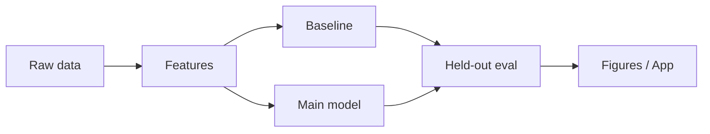

# NILM Energy Disaggregation
> Split a household's whole-home smart-meter signal into per-appliance energy use — the core problem behind modern energy analytics.


<!--  — generated by `make figures` once real data is present -->

## TL;DR
- **Problem:** Split a household's whole-home smart-meter signal into per-appliance energy use — the core problem behind modern energy analytics.
- **Data:** UK-DALE (UKERC) / REDD; optional Kaggle Smart Meters in London ([source](https://data.ukedc.rl.ac.uk/browse/edc/efficiency/residential/EnergyConsumption/Domestic/UK-DALE-2017))
- **Approach:**
  - Baseline: FHMM / combinatorial optimisation (nilmtk)
  - Main: seq2point CNN (PyTorch) per appliance
  - Evaluate with held-out protocol stated in `src/nilm/evaluate.py`
- **Result:** *Pending first real training run — never fabricate metrics.* Headline will compare main vs baseline on: per-appliance MAE (W), F1, TECA; cross-house generalisation
- **Live demo:** Streamlit

## Results

| Approach | Primary metric | Notes |
|---|---|---|
| Baseline (FHMM / combinatorial optimisation) | — | to be filled by `make run` |
| **Main** | — | to be filled by `make run` |

## How it works



seq2point CNN (PyTorch) per appliance is compared against FHMM / combinatorial optimisation (nilmtk) under an explicit split strategy documented in code. Randomness is seeded.

## Reproduce

```bash
git clone https://github.com/divyantpratap/appliance-energy-disaggregation.git
cd appliance-energy-disaggregation
make setup
make data    # downloads into data/raw (not committed)
make run     # train + evaluate + figures
make test
```

## Project structure

```
appliance-energy-disaggregation/
├── README.md
├── Makefile
├── requirements.txt
├── src/nilm/
├── scripts/
├── tests/
├── data/sample/
├── assets/
└── notebooks/01_exploration.ipynb
```

## Limitations & next steps

- Scaffold ships with synthetic `data/sample/` so CI and local smoke tests work before the full dataset download.
- Real metrics are produced only after `make data && make run` against the public source above.
- Next: wire the full download path, complete the main model, regenerate README figures from `scripts/make_figures.py`.

## Data & license

- Source: https://data.ukedc.rl.ac.uk/browse/edc/efficiency/residential/EnergyConsumption/Domestic/UK-DALE-2017
- See `data/README.md` for license notes. Raw data is never committed.
- Code: MIT (see `LICENSE`).
