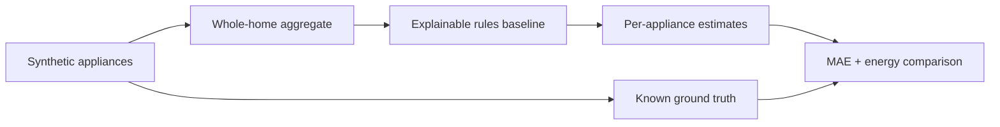

# NILM Energy Disaggregation
> Split a household's whole-home smart-meter signal into per-appliance energy use — the core problem behind modern energy analytics.


## TL;DR
- **Problem:** Split a household's whole-home smart-meter signal into per-appliance energy use — the core problem behind modern energy analytics.
- **Demo data:** deterministic, minute-level synthetic household with known appliance ground truth.
- **Approach:**
  - Baseline: FHMM / combinatorial optimisation (nilmtk)
  - Public demo: explainable rules baseline over aggregate power only
  - Planned study: seq2point CNN per appliance on UK-DALE
- **Result:** interactive signal explorer, energy breakdown, event counts and per-appliance baseline MAE on synthetic ground truth.
- **Live demo:** deploy target `https://divyant-energy-disaggregation.streamlit.app`

## What the demo proves

The published app demonstrates the NILM problem, evaluation mechanics and
failure modes without claiming real-household model performance. Sliders change
the household profile and meter noise; the app compares inferred traces with
known synthetic appliance traces.

## How it works



seq2point CNN (PyTorch) per appliance is compared against FHMM / combinatorial optimisation (nilmtk) under an explicit split strategy documented in code. Randomness is seeded.

## Reproduce

```bash
git clone https://github.com/divyantpratap/appliance-energy-disaggregation.git
cd appliance-energy-disaggregation
make setup
make data    # downloads into data/raw (not committed)
make run     # train + evaluate + figures
make test
```

## Project structure

```
appliance-energy-disaggregation/
├── README.md
├── Makefile
├── requirements.txt
├── src/nilm/
├── scripts/
├── tests/
├── data/sample/
├── assets/
└── notebooks/01_exploration.ipynb
```

## Limitations & next steps

- Synthetic traces are useful for explanation, not evidence of cross-house generalisation.
- The rules baseline is deliberately transparent and imperfect.
- Next: train and evaluate seq2point on licensed UK-DALE households using a held-out-house split.

## Data & license

- Source: https://data.ukedc.rl.ac.uk/browse/edc/efficiency/residential/EnergyConsumption/Domestic/UK-DALE-2017
- See `data/README.md` for license notes. Raw data is never committed.
- Code: MIT (see `LICENSE`).
